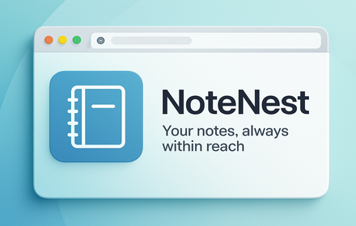
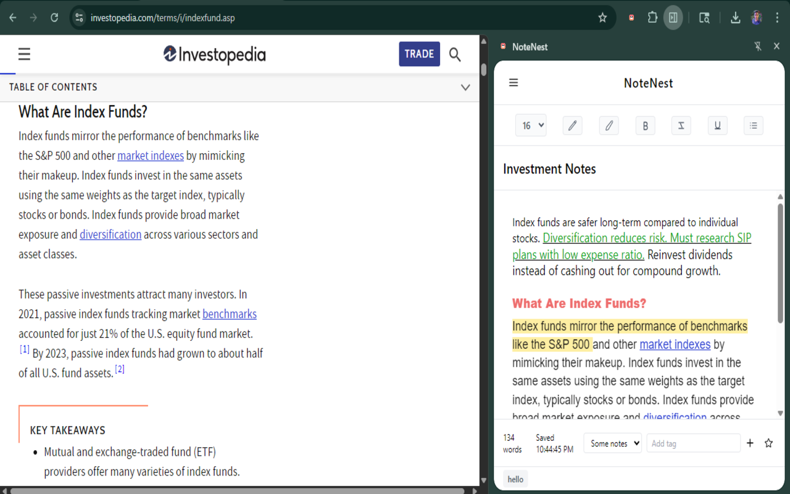
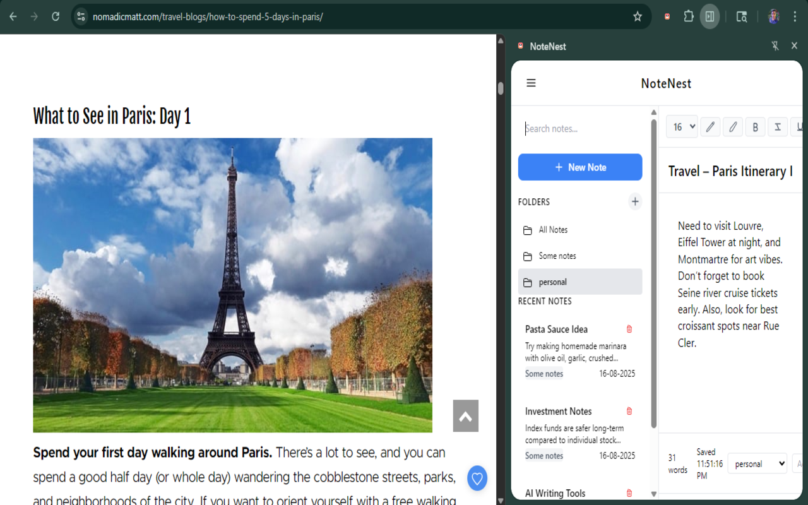

# NoteNest 📝

<div align="center">



**A rich-text notepad living in your browser's side panel.**  
Write, organize, and retrieve your notes without ever leaving your current tab.

[](https://chromewebstore.google.com)
[](https://developer.chrome.com/docs/extensions/mv3/intro/)
[](LICENSE)
[](https://www.google.com/chrome/)

</div>

---

## 📸 Screenshots

<div align="center">

| Sidebar & Editor | Folder View |
|:---:|:---:|
|  |  |

</div>

---

## ✨ Features

### ✍️ Rich Text Editor
- **Bold**, *Italic*, and Underline formatting via toolbar or native keyboard shortcuts
- Per-selection **font size control** — apply different sizes to any text range
- **Text colour picker** with full colour wheel support
- **Highlight colours** — yellow, red, and blue presets, plus one-click highlight removal
- **Bullet lists** with reliable toggle behaviour and clean backspace-to-exit handling
- **Auto-linkification** — pasted URLs are instantly converted to clickable links that open in a new tab
- **Live word count** displayed in the editor footer

### 🗂️ Organization
- **Folders** — group notes into named collections; create new folders and rename existing ones with a right-click context menu
- **Tags** — attach multiple freeform tags to any note for cross-folder categorization
- **Favourites** — star important notes for quick visual identification
- **Folder Grid View** — click any folder to see all its notes in a card layout with previews

### ⚡ Performance & Workflow
- **Instant search** — filters notes in real-time across title and content as you type, debounced for smooth performance
- **Auto-save** — changes are persisted to `chrome.storage.local` two seconds after you stop typing, with a timestamped "Saved" confirmation
- **Backup save** — if the primary save fails, a secondary backup key is written automatically
- **Keyboard shortcuts** — create a new note or focus the search bar without touching the mouse

### 🔒 Security
- **Built-in XSS sanitization** — note content is parsed through a strict allowlist-based HTML sanitizer before being written to the DOM. Unsafe tags, event handler attributes, and `javascript:` hrefs are stripped
- **All data stored locally** — notes never leave your machine. No accounts, no servers, no telemetry
- **`crypto.randomUUID()`** for collision-proof note IDs
- **`rel="noopener noreferrer"`** on all auto-generated links

---

## ⌨️ Keyboard Shortcuts

| Action | Windows / Linux | macOS |
|--------|----------------|-------|
| New note | `Alt + N` | `Ctrl + Shift + N` |
| Focus search | `Alt + S` | `Ctrl + Shift + S` |
| Bold | `Ctrl + B` | `Cmd + B` |
| Italic | `Ctrl + I` | `Cmd + I` |
| Underline | `Ctrl + U` | `Cmd + U` |

---

## 🛠️ Technology Stack

| Layer | Technology |
|-------|-----------|
| Extension Platform | Chrome Extensions API — Manifest V3 |
| UI | HTML5, Vanilla JavaScript (ES2022) |
| Styling | Tailwind CSS v3, self-hosted Manrope (woff2) |
| Storage | `chrome.storage.local` |
| Build | Node.js build script + Tailwind CLI |
| Code Quality | Strict XSS sanitization, debounced handlers, event delegation |

---

## 🚀 Getting Started

### Install from the Chrome Web Store

1. Visit the [NoteNest listing](https://chromewebstore.google.com) on the Chrome Web Store
2. Click **Add to Chrome**
3. Pin the extension from the toolbar puzzle icon
4. Click the NoteNest icon — the side panel opens and you're ready to write

---

### Run from Source (Developers)

#### Prerequisites
- Node.js 18+
- Google Chrome 114+

#### Steps

**1. Clone the repository**
```bash
git clone https://github.com/classyCommits/note-nest.git
cd note-nest
```

**2. Install dependencies**
```bash
npm install
```

**3. Add the Manrope font files**

Download [Manrope](https://fonts.google.com/specimen/Manrope) and convert the four weights to `.woff2`. Place them at:
```
src/assets/fonts/
├── Manrope-Regular.woff2
├── Manrope-Medium.woff2
├── Manrope-SemiBold.woff2
└── Manrope-Bold.woff2
```

> The font is self-hosted because Manifest V3 blocks external network requests from extension pages, including Google Fonts CDN.

**4. Build**
```bash
npm run build
```

This runs the Node.js build script (cleans and recreates `dist/`, copies all source files) followed by the Tailwind CSS compiler.

**5. Load the extension**

- Open `chrome://extensions`
- Enable **Developer mode** (top-right toggle)
- Click **Load unpacked** → select the `dist/` folder
- Pin NoteNest from the toolbar puzzle icon

#### Development mode (CSS hot-rebuild)

```bash
npm run dev
```

Watches `input.css` and recompiles on every save. After JS or HTML changes, click the reload icon on the NoteNest card at `chrome://extensions`.

---

## 📁 Project Structure

```
note-nest/
├── src/
│   ├── assets/
│   │   ├── fonts/          # Self-hosted Manrope woff2 files
│   │   └── icons/          # Extension icons (16, 48, 128px)
│   ├── background/
│   │   └── background.js   # Service worker — panel open, shortcuts, init
│   ├── sidepanel/
│   │   ├── sidepanel.html  # Side panel markup
│   │   ├── sidepanel.js    # All application logic (~1600 lines)
│   │   └── input.css       # Tailwind entry point + custom component styles
│   └── manifest.json       # Extension manifest (MV3)
├── scripts/
│   └── build.js            # Cross-platform Node.js build script
├── dist/                   # Built extension (load this in Chrome)
├── docs/                   # Screenshots for README
├── tailwind.config.js
├── postcss.config.js
└── package.json
```

---

## 🏗️ Architecture Notes

**Single-class architecture** — all UI logic lives in the `NoteNest` class in `sidepanel.js`. Key design decisions:

- **DOM caching** — all elements are cached once in `_cacheDOMElements()` at startup; no repeated `getElementById` calls during runtime
- **Event delegation** — note list, folder list, and folder grid all use single delegated listeners on their containers, not per-card listeners
- **Debounced search** — search input is debounced at 300ms to avoid re-rendering the list on every keystroke
- **`DocumentFragment` rendering** — all list renders use a fragment to batch DOM insertions and avoid layout thrashing
- **Two-layer save** — `autoSave()` debounces writes by 2 seconds; on failure, a backup key is written to prevent data loss
- **Custom HTML sanitizer** — a recursive DOM walker enforces an allowlist of tags (`p, b, i, u, ul, li, span, div, br, a`) and attributes (`style, href, data-font-size-span`), stripping everything else including `on*` event handlers and `javascript:` URIs

---

## 🤝 Contributing

Contributions, bug reports, and feature requests are welcome.

1. Fork the repository
2. Create a feature branch: `git checkout -b feature/your-feature-name`
3. Commit with a descriptive message: `git commit -m 'feat: add export to markdown'`
4. Push and open a Pull Request

Please keep PRs focused — one feature or fix per PR makes review faster.

---

## 📄 License

This project is licensed under the **MIT License** — see the [LICENSE](LICENSE) file for details.

---

<div align="center">

Built with Vanilla JS · No frameworks · No external dependencies at runtime

⭐ Star this repo if NoteNest made your browser a little more productive

</div>